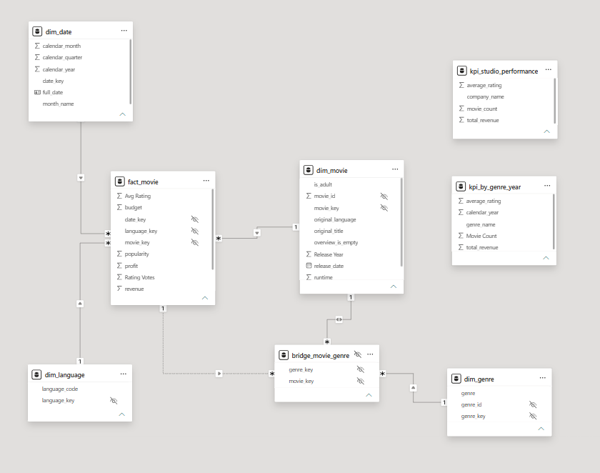

# Engineering & Analytics Capstone: TMDB Movie Intelligence


---

## The story / business context

You are a data team at a film-analytics startup. Producers and investors want to
understand what makes movies successful: which genres perform, how budgets relate
to revenue, how ratings trend over time, and which studios dominate. Your job is
to take raw, inconsistent data from The Movie Database (TMDB) and deliver a
trustworthy, well-modeled dataset plus an executive dashboard.

The raw data is **not clean**. That is the point. Real pipelines spend most of
their effort turning mess into trust.

---

## Tech stack

| Concern | Tool |
|---|---|
| Data source | TMDB REST API (`https://api.themoviedb.org/3`) |
| Ingestion / Python cleaning | Python 3.10+, `requests`, `pandas` |
| Database / SQL cleaning | **Microsoft SQL Server** (T-SQL), `pyodbc` or `sqlalchemy` |
| Dashboard | **Power BI Desktop** (native SQL Server connector) |
| Version control | Git |

### Prerequisites / setup checklist

- [ ] Free TMDB account + **API key** — https://www.themoviedb.org/settings/api
      (request a "Developer" key; the v3 API key is a string you pass as
      `?api_key=...`).
- [ ] Python 3.10+ with `requests`, `pandas`, `pyodbc` (or `sqlalchemy`).
- [ ] SQL Server (any edition — Developer/Express is free) + **ODBC Driver 18
      for SQL Server**.
- [ ] Power BI Desktop (analytics cohort only — free download).
- [ ] A Git repo for your team.

---

## Suggested repository structure

```
engineering_analytics/
├── README.md                     ← this file
├── Part1_Data_Engineering.md     ← the DE brief (everyone)
├── Part2_PowerBI_Dashboard.md    ← the BI brief (analytics cohort)
├── .env.example                  ← template for TMDB_API_KEY, DB connection
├── src/
│   ├── ingest_bronze.py          ← API pulls → raw JSON landing
│   ├── clean_silver_python.py    ← pandas cleaning path
│   └── load_to_sqlserver.py      ← land raw JSON into SQL Server
├── sql/
│   ├── 00_create_schemas.sql     ← bronze / silver / gold schemas
│   ├── 10_clean_silver_tsql.sql  ← T-SQL cleaning path (OPENJSON)
│   └── 20_build_gold.sql         ← star schema + KPIs
├── data/
│   ├── bronze/                   ← raw JSON dumps (gitignored)
│   ├── silver/                   ← cleaned parquet/csv (gitignored)
│   └── gold/                     ← final tables/exports (gitignored)
└── powerbi/
    └── movie_dashboard.pbix
```

---

## The medallion architecture in one picture

```
   TMDB API (messy JSON)
          │
          ▼
   ┌──────────────┐   Raw, as-is. Nothing thrown away.
   │   BRONZE     │   Store the truth of what the API returned.
   └──────────────┘
          │
          ▼
   ┌──────────────┐   Cleaned, typed, deduplicated, conformed.
   │   SILVER     │   ← built TWICE: pandas AND T-SQL
   └──────────────┘
          │
          ▼
   ┌──────────────┐   Business-ready star schema + aggregates/KPIs.
   │    GOLD      │   ← what Power BI connects to.
   └──────────────┘
          │
          ▼
   Power BI dashboard
```

**Rule of thumb:** each layer is *derived only from the layer above it*. You
should be able to delete Silver and Gold and rebuild them from Bronze. That is
what makes a pipeline reproducible.

---

## Grading / definition of done (high level)

| Area | Weight |
|---|---|
| Bronze ingestion is reproducible and preserves raw data | 15% |
| Silver cleaning correct **in both Python and T-SQL**, results match | 30% |
| Gold star schema is correct and query-friendly | 20% |
| Power BI dashboard (analytics cohort) / stretch goals (DE cohort) | 25% |
| Code quality, docs, git hygiene, no leaked secrets | 10% |

Detailed acceptance criteria live in each part's file.


# 

##  **Python vs SQL comparison note** 

I created different schemas for pandas and SQL path, to compare later their results.

SELECT COUNT(*) FROM silver_python.movies;
SELECT COUNT(*) FROM silver.movies;

SELECT COUNT(*) FROM silver_python.movie_genres;
SELECT COUNT(*) FROM silver.movie_genres;

SELECT COUNT(*) FROM silver_python.movie_companies;
SELECT COUNT(*) FROM silver.movie_companies;

SELECT COUNT(*) FROM silver_python.movie_cast;
SELECT COUNT(*) FROM silver.movie_cast;

from queries above we got rusults:

silver_python.movies; 997
silver.movies; 997

silver_python.movie_genres; 2161
silver.movie_genres; 2161

silver_python.movie_companies; 2522
silver.movie_companies; 2522

silver_python.movie_cast; 5567
silver.movie_cast; 5567


                     Bronze
                        │
          ┌─────────────┴─────────────┐
          │                           │
          ▼                           ▼
   Python (Pandas)             SQL Server (T-SQL)
          │                           │
          ▼                           ▼
     Silver (Python)             Silver (SQL)
          │                           │
          └─────────────┬─────────────┘
                        ▼
                 Gold Star Schema
                        ▼
                   Power BI Dashboard

When I first run those queries i got different results in movie_companies tables. The issue was in removing dublicates in sql.

## star schema + KPI views.

